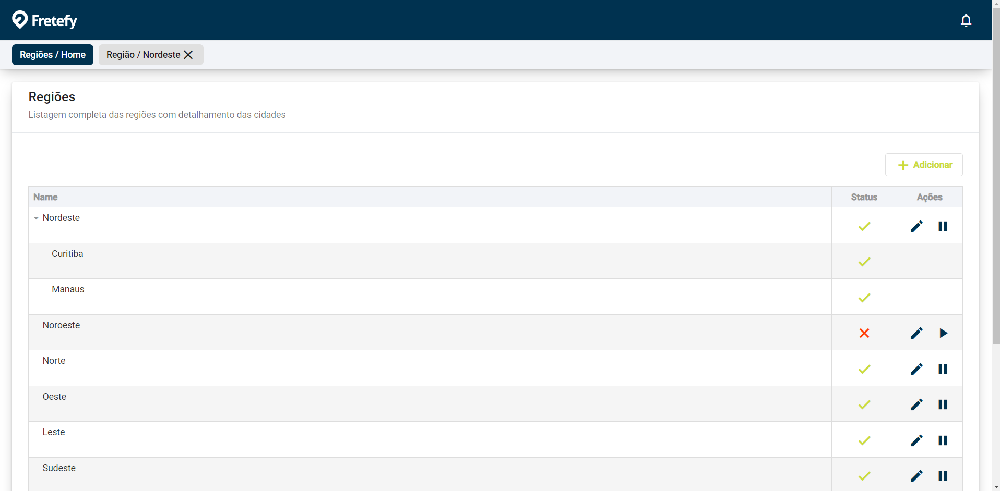

# FretefyFrontend

## Versões bases de configuração do projeto utilizadas:

Angular 	-->		10.2.0 	
 
Node JS 	-->  		^10.13.0 || ^12.11.0
 
Typescript 	--> 		>=3.9.0 <\4.1.0	
 
RXJS 		-->		^6.5.3

Fonte: https://angular.io/guide/versions#unsupported-angular-versions

     

# Parte 1

Projeto se encontra mantida na branch do fork sendo feature/estrutura

Inicialmente não sabia se era mais prático dar um ng update do projeto para uma versão mais recente do Angular,  ou se usava o nvm pra trocar a versão do meu node,  optei por trocar a versão do node e assumir os riscos de perder o suporte do Angular na versão antiga e mostrar que conseguiria trabalhar em um projeto legado,  julgando que eu estivesse trabalhando em um projeto legado cujo a versão fosse menor e dificil de ser atualizada.

 
Realizado em dois dias
Iniciando dia 15/03 -> Descanso 16/03 -> Finalizado dia 17/03

## Funcionalidades do Projeto

-> Módulo de Loader genérico.
 
-> Módulo de Navbar interativo.
 
-> Componente de select search com desenvolvimento focado em carregamento pesado de dados.
 
-> Treelist para exibição dos dados na home.
 
-> Shared com as entidades e services genéricos.
 
-> Tooltips
 
-> Demais funcionalidades de requisitos (Validator duplicado, Tooltips, Requireds e utilizado diversos operadores rxJS).
 

## Imagens demonstrativas

## Contextualização

Primeiramente realizei estruturação de um projeto para possuir uma ampla escalabilidade.
 
Sofri alguns problemas principalmente do devextreme pela falta de recurso na lib que utilizei por não ter suporte nas versões recentes dele para versão do Angular na 10.
 
Após a estruturação da base, iniciei o desenvolvimento dos requisitos no backlog.
 
Utilizei o json-server para simular o retorno de uma API.
 
Não utilizei nenhum tipo de grid como o flexbox por exemplo, pois não encontrei algo realmente necessário, mas conheço bem a tecnologia.
 
Usei um pouco de cada coisa para demonstrar algumas técnicas que conheço, tem outras funcionalidades também mas achei que se implementasse não daria tempo de entregar na segunda-feira que era meu planejado.
 
Não implementei os testes em Jasmine e Protector pois disseram não ser necessário.
 
Caso encontre algum erro ou impedimento ao rodar o projeto, estou disponível, Agradeço desde já a participação !

     

# Parte 2

Projeto se encontra mantida na branch do fork sendo feature/reestruturacao-apenas-css, e vou subir na main sobrescrevendo a parte 1.

Foi aberto uma solicitação para medir mais conhecimento tendo como requisito técnico a remoção da bibliotecas de estilização (Devextreme, Angular Material). 
Vou julgar também que não posso usar bibliotecas como angular/flex-layout para estilização das grids e vou montar tudo manual com CSS nativo. 
Meu backlog é fazer toda uma reestrutura da parte 1 em uma nova branch e também adicionar um novo cadastro de cidades.
 

Iniciando dia 19/03

Prazo final Sexta-feira 22/03 às 23:59.

## Versões bases de configuração do projeto utilizadas:

Angular 	-->		10.2.0 	
 
Node JS 	-->  		^10.13.0 || ^12.11.0
 
Typescript 	--> 		>=3.9.0 <\4.1.0	
 
RXJS 		-->		^6.5.3
